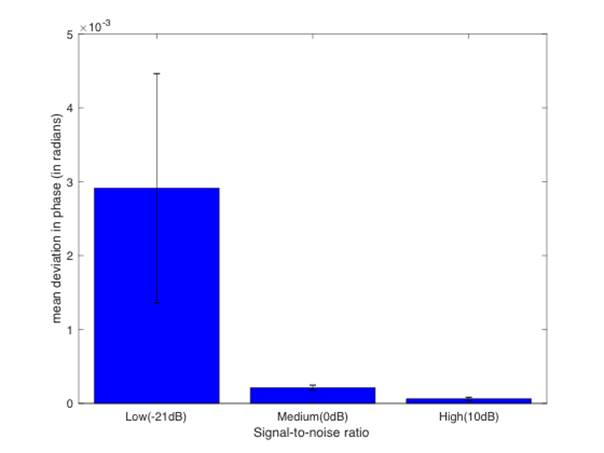
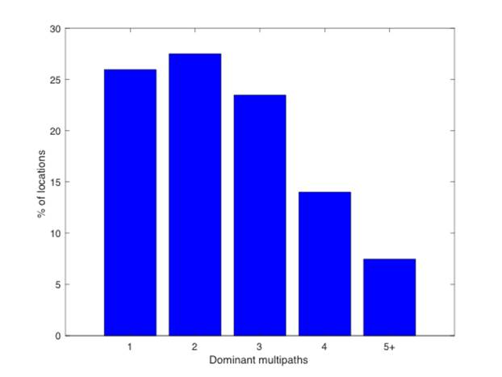
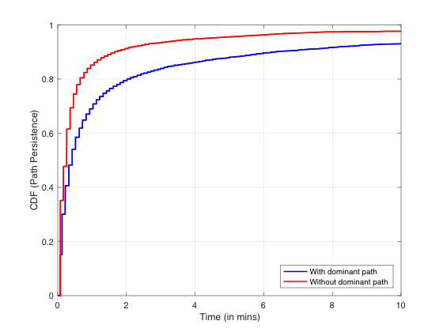
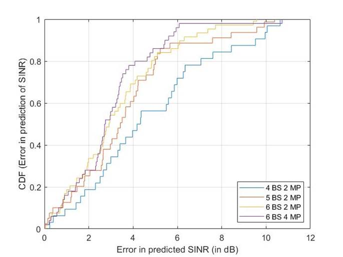
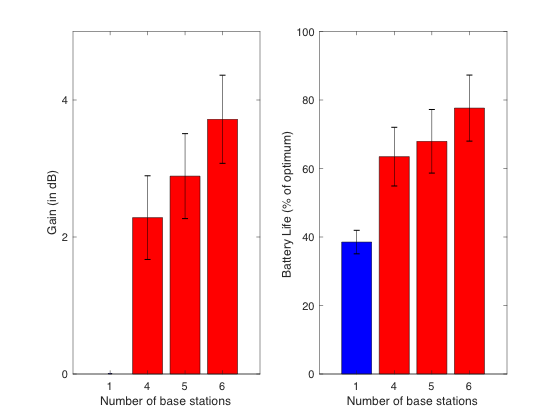
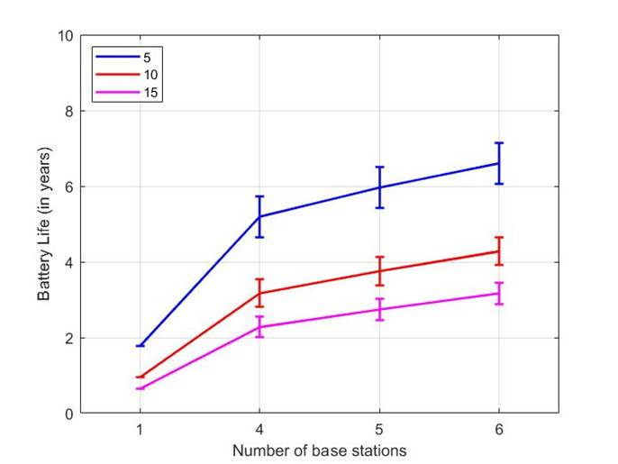
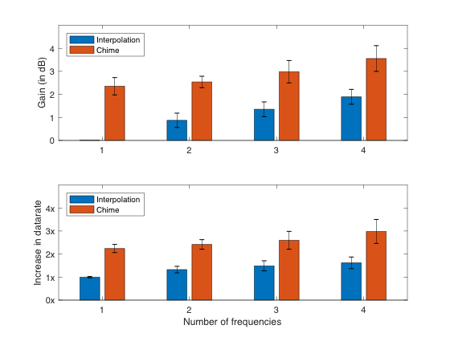
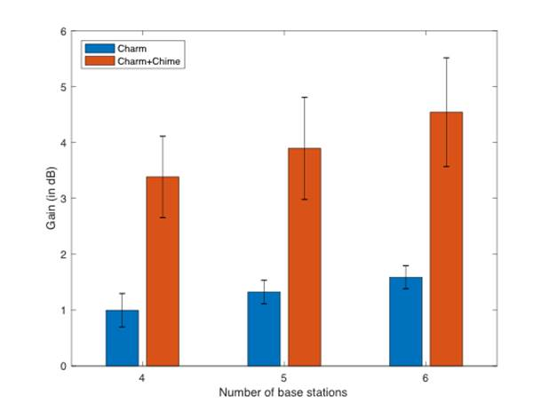
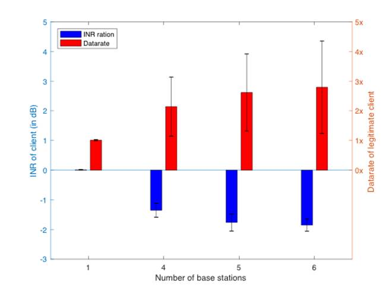

# Chime-Solution
## Abstract
This is Part of the code in the reproduction process of Chime, the nsdi2020 conference paper.Some of the core algorithms used in Chime's reproduction work are given in the project warehouse

> paper: https://www.usenix.org/conference/nsdi20/presentation/gadre
> 
> dataset: https://cmu.box.com/s/ftqnqywb0jnf4a3kl4si81uums5153h4 
## Introduction of the Paper of Chime
Low-power Wide-Area Networks (LP-WANs) are seen as a leading candidate to network the Internet-of-Things at city-scale. Yet, the battery life and performance of LPWAN devices varies greatly based on their operating frequency. In multipath-rich urban environments, received signal power varies rapidly with a low-power transmitter’s frequency, impacting its transmission time, data rate and battery life. However, the low bandwidth of LP-WANs means that there are hundreds of operating frequencies to choose from. Among them, we show how choosing a select few of these frequencies(~3.55%) effectively triples the battery life when compared to the rest for LP-WAN devices.

This paper presents Chime, a system enabling LP-WAN base stations to identify an optimal frequency of operation after the client sends one packet at one frequency. Chime achieves this by analyzing the wireless channels of this packet across many base stations to disentangle multipath and ascertain an optimal frequency that maximizes client battery life and minimizes interference. We implement Chime on a campus-scale test-bed and achieve a median gain of 3.4 dB in SINR leading to a median increase in battery life of 230% (~1.4-5.7 years), data rate by 3.3x and reduction in interference of 2.8x over commodity LP-WANs.
## Overview of Chime
This section provides an overview of Chime’s approach and challenges. Chime’s primary goal is to accurately measure an optimal operating frequency for an LP-WAN client by making it transmit only one packet on one frequency band. It primarily aims to predict the received signal power of the client across all frequencies at base stations. Since base stations span a wide bandwidth, they can readily measure channel occupancy and noise levels across frequencies, leaving received signal power from a client as the primary unknown.

Chime’s system architecture is designed as follows: Upon waking up and for signal association, each LP-WAN device transmits a beacon packet on its arbitrarily chosen initial frequency of operation (a standard feature of common LP-WAN protocols). Chime then processes the received signals from this packet across the base stations at the cloud via a wired backhaul to infer an optimal frequency of operation. Note that since the powered base stations and the cloud perform all computation, this does not impact client battery life. The nearest base station then reports the estimated frequency to the client in its acknowledgment of the beacon.

> **Assumptions:** *While Chime does not consider mobile clients, we do consider dynamic outdoor environments. While Chime does not model fleeting reflectors in environment, it models long-term changes in multipath as it re-analyzes the current multipath based on transmissions from the client beacon and the master base station.* 

* This paper describes three challenges in achieving the above design: 
  * ***(1) Synchronizing Distributed Base Stations:*** Chime first develops a synchronization system that allows multiple base stations to coordinate. In doing so, it eliminates the time-varying and long-lasting phase errors due to hardware impediments, such as frequency, timing and phase offsets of low-cost and low-power wireless hardware.
  * ***(2) Disentangling Signal Paths:*** Next, Chime analyzes the root cause of why signal power from the client would vary across frequencies in the first place – wireless multipath. Specifically, signals from the client traverse multiple paths as they reflect off buildings, trees and other objects before reaching the base stations. Signals along these paths can reinforce each other or cancel each other, depending on the frequency of operation. At the cloud, Chime combines measurements from the distributed array of base stations to decouple the different paths the signal traversed from the client, even if the geometry of these base stations is arbitrary and the environment is multipath-rich.
  *  ***(3) Estimating Optimal Frequency:*** Chime then recombines the signal components at all possible operating frequencies to determine their expected signal power across base stations. Chime can then use this information, along with the known interference and ambient noise at these frequencies perceived at base stations to determine the best frequency-of-operation.

## Recurring results of the paper

The following is a series of pictures of some statistical results in the author's paper reproduced by the algorithm.

 ### Fig 9 Phase Stability

***Phase of offset-free channel in multipath-rich scenarios is stable across SINRs***

### Fig 10 Multipath Sparsity

***Histogram of # dominant paths shows sparsity of multipath in urban environment***

### Fig 11 Path Persistence

***Sparse multipath is unstable across minutes***

### Fig 12 SINR Goodness-of-Fit

***CDF of predicted vs. actual SINR across base stations***

### Fig 13

***(left) Gain in SINR (dB) by using Chime vs. median frequency of operation***

***(Right) Battery life of Chime vs. temporal interpolation technique***

### Fig 14 Gain in battery life across # messages per hour

***Battery life increases 1.4-5.7 years for LP-WAN clients***

### Fig 15 

***Gain in SINR and improvement in datarate vs. interpolation for # of frequencies used for training***

### Fig 16 Chime + Charm

***Improvement in Gain(dB) when Charm is assisted by Chime***

### Fig17 

***Nulling of unwanted interference leads to improved data rate for legitimate client with Chime***

